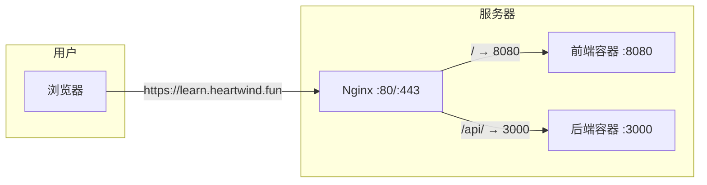

# Nginx 反向代理 + HTTPS（心风域名 learn.heartwind.fun）

适用场景：宿主机已装 Nginx，LearnFlow 前端在 8080、后端在 3000，用三级域名 `learn.heartwind.fun` 对外提供 HTTPS。

---

## 一、前置条件

- 域名 `heartwind.fun` 已解析到当前服务器（A 记录或 CNAME）。
- 三级域名 **learn.heartwind.fun** 已解析到同一台服务器（A 记录指向服务器 IP，或 CNAME 到主域名）。
- 本机已安装 Nginx、Docker、Docker Compose，LearnFlow 已用 `PORT=8080` 跑起来（`docker compose up -d` 成功）。

---

## 二、方案概览



- 用户只访问 **https://learn.heartwind.fun**。
- Nginx 将 `/` 转到前端（127.0.0.1:8080），将 `/api/` 转到后端（127.0.0.1:3000）。
- 前端需用「同源 /api」构建，见下文。

---

## 三、步骤 1：DNS

在域名服务商处为 **heartwind.fun** 增加一条解析：

| 类型 | 主机/名称 | 值/目标 | TTL |
|------|------------|---------|-----|
| A    | learn      | 你的服务器公网 IP | 600 |

（若用 CNAME：名称为 `learn`，目标为 `heartwind.fun` 或你主站域名。）

保存后等 2–5 分钟，在本地执行 `ping learn.heartwind.fun` 确认解析到正确 IP。

---

## 四、步骤 2：暴露后端给 Nginx

Nginx 在宿主机上，需要能访问后端 3000 端口。在 **项目根目录** 的 `docker-compose.yml` 里给 `backend` 增加 `ports`（仅绑定本机）：

```yaml
  backend:
    # ... 原有 build、environment 等 ...
    ports:
      - "127.0.0.1:3000:3000"
```

保存后执行：

```bash
docker compose up -d
```

确认 backend、frontend 都在运行。

---

## 五、步骤 3：前端用「同源 /api」重新构建（重要）

浏览器访问的是 `https://learn.heartwind.fun`，接口需走同源 `https://learn.heartwind.fun/api`。项目内前端 Dockerfile 已默认 `VITE_API_URL=/api`，只需重新构建并启动：

```bash
cd /data/project/learnflow
docker compose build --no-cache frontend
docker compose up -d
```

若需覆盖为其他地址（例如直连后端）：`docker compose build --build-arg VITE_API_URL=https://api.example.com/api --no-cache frontend`

---

## 六、步骤 4：Nginx 配置

### 4.1 创建 Certbot 目录

```bash
sudo mkdir -p /var/www/certbot
```

### 4.2 复制并启用站点配置

```bash
# 复制示例配置（按需改域名）
sudo cp /data/project/learnflow/deploy/nginx-learnflow.conf /etc/nginx/sites-available/learnflow

# 若域名不是 learn.heartwind.fun，编辑替换
sudo sed -i 's/learn\.heartwind\.fun/你的三级域名/g' /etc/nginx/sites-available/learnflow

# 启用站点
sudo ln -sf /etc/nginx/sites-available/learnflow /etc/nginx/sites-enabled/

# 测试配置
sudo nginx -t
```

**首次申请证书前**：保持 `deploy/nginx-learnflow.conf` 里 HTTP 的 `location /` 为 `proxy_pass http://127.0.0.1:8080;`（不要用 `return 301`），否则 Let's Encrypt 验证会失败。

### 4.3 重载 Nginx

```bash
sudo systemctl reload nginx
```

---

## 七、步骤 5：申请 HTTPS 证书（Let's Encrypt）

### 5.1 安装 certbot（未安装时）

```bash
sudo apt-get update
sudo apt-get install -y certbot
# 可选：用 Nginx 插件则安装
# sudo apt-get install -y python3-certbot-nginx
```

### 5.2 申请证书（webroot 方式）

把 `learn.heartwind.fun` 换成你的三级域名：

```bash
sudo certbot certonly --webroot -w /var/www/certbot -d learn.heartwind.fun --email 你的邮箱@example.com --agree-tos --no-eff-email
```

按提示完成即可，证书会放在 `/etc/letsencrypt/live/learn.heartwind.fun/`。

### 5.3 启用 HTTPS 并强制跳转

证书成功后：

1. 编辑站点配置：
   ```bash
   sudo nano /etc/nginx/sites-available/learnflow
   ```
2. 在 **HTTP 的 server 块**里，把 `location /` 从：
   - `proxy_pass http://127.0.0.1:8080;` 及后面几行
   改为：
   - `return 301 https://$server_name$request_uri;`
3. **取消注释**（或保留）**HTTPS 的 server 块**（listen 443、ssl_certificate 等），确保证书路径为：
   - `ssl_certificate     /etc/letsencrypt/live/learn.heartwind.fun/fullchain.pem;`
   - `ssl_certificate_key /etc/letsencrypt/live/learn.heartwind.fun/privkey.pem;`
   - `include /etc/letsencrypt/options-ssl-nginx.conf;`
   - `ssl_dhparam /etc/letsencrypt/ssl-dhparams.pem;`  
   （若系统没有 `ssl-dhparams.pem`，可先运行一次 `sudo certbot --nginx` 或 `sudo certbot renew --dry-run` 让 certbot 生成。）

4. 测试并重载：
   ```bash
   sudo nginx -t && sudo systemctl reload nginx
   ```

---

## 八、步骤 6：CORS 与后端环境变量

后端需允许前端域名，否则浏览器可能报 CORS 错误。在项目根目录 `.env` 中设置（与三级域名一致）：

```env
CORS_ORIGIN=https://learn.heartwind.fun
```

然后重启后端：

```bash
docker compose up -d backend
```

---

## 九、证书续期（可选）

Let's Encrypt 证书约 90 天有效，可用 cron 自动续期：

```bash
sudo certbot renew --quiet
sudo systemctl reload nginx
```

或使用 systemd timer / 其他方式定期执行上述两条命令。

---

## 十、自检清单

| 项目 | 命令或检查 |
|------|------------|
| DNS 生效 | `ping learn.heartwind.fun` 指向服务器 IP |
| 后端对本机可达 | `curl -s http://127.0.0.1:3000/health` 返回 JSON |
| 前端对本机可达 | `curl -sI http://127.0.0.1:8080` 返回 200 |
| Nginx 配置 | `sudo nginx -t` 通过 |
| HTTPS | 浏览器打开 https://learn.heartwind.fun 无证书报错，且页面与接口正常 |

完成以上步骤后，即可通过 **https://learn.heartwind.fun** 访问 LearnFlow，并由 Nginx 提供 HTTPS 与反向代理。
