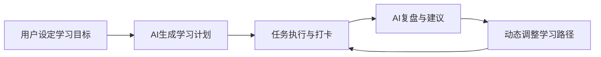
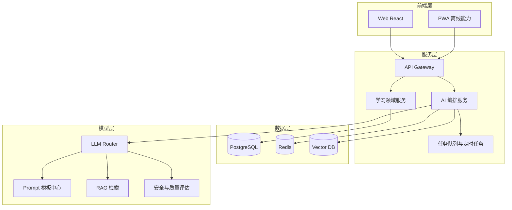
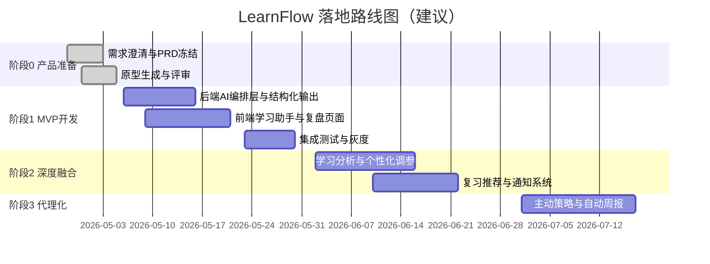

# LearnFlow AI 深度融合落地总方案（不含支付）

## 1. 目标与边界

## 1.1 目标

在现有 LearnFlow（Web + Node + Prisma）基础上，落地一个可持续演进的 AI 学习产品，完成以下能力：

- 学习闭环：目标 -> 计划 -> 执行 -> 复盘 -> 调整
- AI 深度融合：从计划生成升级为学习助手 + 学习教练
- 工程可落地：模块化、可测试、可灰度、可观测
- 多阶段可交付：每个阶段都可开发、可演示、可验收

## 1.2 本阶段边界

- 暂不接支付与订阅
- 暂不做复杂社交系统（先留轻量分享能力）
- 先以 Web/PWA 为主，移动端壳后置到阶段 3

## 2. 总体蓝图

## 2.1 系统架构（目标态）

## 3. 技术落地方案（基于当前仓库）

## 3.1 后端模块拆分建议

建议在 `server/src` 下新增：

- `modules/learning/`
  - `goal.service.ts`
  - `plan.service.ts`
  - `task.service.ts`
  - `checkin.service.ts`
  - `review.service.ts`
- `modules/ai/`
  - `orchestrator.ts`（统一 AI 入口）
  - `providers/openrouter.provider.ts`
  - `prompts/`（版本化 prompt）
  - `schemas/`（结构化输出约束）
  - `evaluator/`（质量评估）
- `modules/analytics/`
  - 学习行为统计、漏斗、留存分析
- `infra/queue/`
  - 定时任务、异步 AI 任务、通知任务

## 3.2 前端模块拆分建议

建议在 `client/src` 下按 feature 拆分：

- `features/dashboard/`
- `features/planner/`
- `features/coach-chat/`
- `features/review/`
- `features/analytics/`
- `features/notifications/`

## 3.3 数据层升级建议

- 保留 PostgreSQL（主业务数据）
- 引入 Redis（会话缓存、任务队列、热点缓存）
- 引入向量库（学习知识与历史问答检索）

## 4. AI 深度融合路径（分阶段）

## 阶段 1：AI 助手（4-6 周）

### 能力

- 对话式学习助手（上下文记忆）
- 计划生成质量提升（结构化校验 + 回退机制）
- AI 周复盘自动摘要

### 验收

- 主流程成功率 >= 95%
- AI 返回结构化有效率 >= 98%
- 失败回退可用率 = 100%

## 阶段 2：AI 教练（6-8 周）

### 能力

- 学习行为分析（完成率、稳定性、高效学习时段）
- 个性化动态调参（任务难度、节奏）
- 智能复习计划（遗忘曲线）

### 验收

- 周活提升 >= 15%
- 任务完成率提升 >= 10%
- 用户主观“有帮助”评分 >= 4/5

## 阶段 3：AI 代理雏形（8-10 周）

### 能力

- 自动分解目标与里程碑
- 主动提醒 + 风险预警（连续未学习）
- 一周学习自动回顾与下周建议

### 验收

- 连续 2 周留存提升 >= 12%
- 中断后召回率提升 >= 10%

## 5. 分模块开发路线图

## 6. 研发与测试策略

## 6.1 测试金字塔

- 单元测试：服务层、工具函数、提示词解析
- 集成测试：API + DB + AI 编排
- E2E：核心用户路径（注册、建目标、生成计划、完成任务、复盘）

## 6.2 发布门禁

- P0 缺陷必须清零
- 核心接口覆盖率 >= 70%
- AI 核心链路有回退方案
- 关键指标埋点齐全

## 7. 产品与工程协同机制（配合新装 skill）

## 7.1 用 `product-manager-toolkit` 做什么

- 用户访谈分析
- RICE 排序与路线优先级
- PRD 标准化与验收标准输出

## 7.2 用 `prd-prototype` 做什么

- 按 PRD 自动生成可点击原型
- 固定页面契约（避免漏页面）
- 原型评审后再进开发，减少返工

## 8. 风险与应对

| 风险       | 表现              | 应对                    |
| -------- | --------------- | --------------------- |
| AI 成本不稳定 | 调用激增导致成本上升      | 限流 + 缓存 + 模型分级        |
| 输出不稳定    | JSON 不可解析       | 强约束 schema + fallback |
| 需求飘移     | Sprint 内频繁改 PRD | 版本冻结 + 变更门禁           |
| 质量不可见    | 线上问题难定位         | 全链路日志 + 指标告警          |

## 9. 完成定义（Definition of Success）

满足以下条件，判定方案落地成功：

- 产品：MVP 主流程可闭环，用户可独立完成一个学习周期
- 技术：AI 能力可观测、可回退、可迭代
- 交付：阶段性计划持续达成，版本可稳定灰度发布
- 数据：关键业务指标具备可比较的提升趋势

