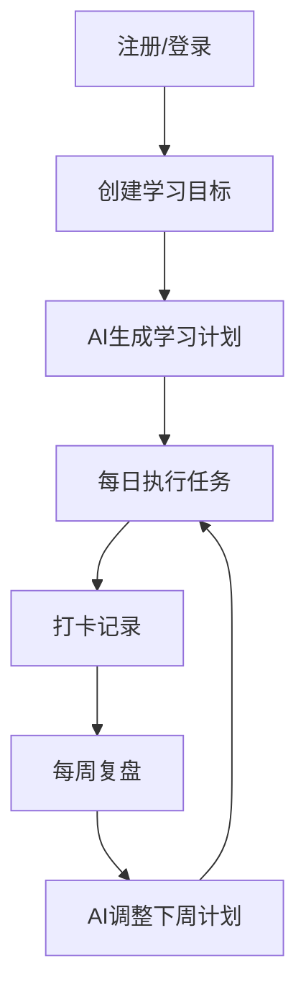

# LearnFlow MVP PRD v1

版本：v1.0  
状态：待评审  
负责人：产品/研发联合  
更新时间：2026-04-25

## 1. 背景与问题

当前用户在自学过程中常见问题：

- 目标不清晰，计划不现实
- 学习执行不稳定，容易中断
- 缺乏及时反馈，不知道如何调整

LearnFlow 要解决的核心问题：  
让用户以更低认知负担，完成“目标设定 -> 稳定执行 -> 周期复盘 -> 路径迭代”。

## 2. 产品目标（MVP）

在不接支付的情况下，验证以下价值：

1. 用户能在 10 分钟内完成首次学习计划创建。
2. 用户能连续 7 天执行至少 1 个学习任务。
3. AI 能够在计划、复盘、调整三个环节提供有效帮助。

## 3. 目标用户

## 3.1 核心用户

- 有明确成长诉求的个人学习者（技能提升/转岗/考试）
- 每周可投入 3-10 小时学习时间

## 3.2 非目标用户（MVP 不覆盖）

- 企业培训管理员复杂后台场景
- K12 家长/老师强监管场景
- 强社交学习社区场景

## 4. 范围定义

## 4.1 In Scope

- 用户认证（邮箱密码、第三方 OAuth）
- 目标管理（创建、编辑、追踪）
- AI 学习计划生成（按周/天拆解）
- 任务完成与打卡
- 周复盘（AI 总结 + 下周建议）
- 学习进度可视化（基础图表）

## 4.2 Out of Scope

- 支付与订阅
- 高级社交关系链
- 多租户企业管理
- 原生移动端（MVP 仅 Web + PWA）

## 5. 核心流程

## 6. 功能需求（MVP）

## FR-01 用户认证

- 支持邮箱密码登录
- 支持 Google/GitHub OAuth
- 未登录用户不可访问业务页面

**验收标准**
- 登录成功后跳转 Dashboard
- Token 过期后自动回到登录页

## FR-02 目标管理

- 创建目标：标题、描述、目标日期
- 目标状态：进行中/暂停/完成/取消
- 展示目标进度

**验收标准**
- 新建目标默认状态为进行中
- 状态切换后页面实时刷新

## FR-03 AI 计划生成

- 输入：目标、当前水平、每周学习时长、周期
- 输出：周计划、日任务、学习资源、Mermaid 学习路径图
- 失败时自动 fallback 到规则计划

**验收标准**
- 结构化 JSON 可解析
- 周任务总时长不超过用户输入阈值（允许 15% 浮动）

## FR-04 执行与打卡

- 任务勾选完成
- 每日打卡（时长、笔记、评分）
- 自动更新计划进度

**验收标准**
- 任务完成后进度自动更新
- 打卡记录可按日期查询

## FR-05 周复盘

- 用户提交本周复盘（文本）
- AI 输出：本周总结 + 下周改进建议

**验收标准**
- 复盘结果可保存、可回看
- 建议内容和当前计划有关联

## FR-06 可视化与成就

- 学习时长趋势图
- 打卡日历
- 成就解锁（至少 3 类）

**验收标准**
- 图表显示正确无空白异常
- 达成条件触发后 3 秒内显示成就提示

## 7. 非功能需求

- 可用性：主流程页面响应 < 2 秒
- 稳定性：核心 API 成功率 >= 99%
- 安全性：鉴权、限流、输入校验、敏感日志脱敏
- 可观测：AI 调用、错误率、耗时、回退率可追踪

## 8. 关键指标（MVP 评估）

- 激活率：注册后 24 小时内创建首个目标
- 首周留存（D7）
- 计划执行率（任务完成占比）
- AI 有效帮助率（用户反馈有帮助）
- 周复盘提交率

## 9. 用户故事（样例）

1. 作为一个转岗学习者，我希望快速生成可执行学习计划，避免盲目学习。
2. 作为一个忙碌上班族，我希望每天只看到当天任务，减少负担。
3. 作为一个自学者，我希望每周有人帮我复盘并指出改进方向。

## 10. 接口与数据要求（摘要）

- 计划生成接口必须返回固定字段：
  - `title`, `description`, `durationWeeks`, `weeklyPlans`, `mermaidCode`
- 任务完成变更后必须触发进度重算
- AI 失败必须写入错误码和回退标记

## 11. 里程碑

| 里程碑 | 时间 | 产物 |
| --- | --- | --- |
| M1 PRD 冻结 | W1 | 本文档 + 评审结论 |
| M2 原型完成 | W2 | 可点击原型 |
| M3 开发联调 | W4 | MVP Alpha |
| M4 灰度发布 | W6 | MVP Beta |

## 12. 测试用例（10 条）

| 编号 | 输入/动作 | 预期结果 |
| --- | --- | --- |
| TC-01 | 新用户注册并登录 | 进入 Dashboard，Token 有效 |
| TC-02 | 创建目标（8 周） | 目标创建成功，状态为 ACTIVE |
| TC-03 | AI 生成计划 | 返回结构化计划与 Mermaid 图 |
| TC-04 | AI 返回异常文本 | 系统 fallback 成功，提示可理解 |
| TC-05 | 勾选任务完成 | 计划进度正确增加 |
| TC-06 | 连续打卡 7 天 | 解锁连续打卡成就 |
| TC-07 | 提交周复盘 | 保存成功并生成 AI 建议 |
| TC-08 | 非法访问他人计划 | 返回 404/403 |
| TC-09 | Token 过期后请求 API | 返回 401 并引导重新登录 |
| TC-10 | 弱网下刷新任务页 | 有加载占位，无白屏崩溃 |

## 13. 发布与回滚策略

- 先灰度给内部测试用户
- 若核心链路异常率 > 2%，立即回滚至上一稳定版本
- 回滚不影响用户已有目标与历史数据

## 14. 评审结论区（待填写）

- 产品评审：
- 研发评审：
- 测试评审：
- 最终范围冻结日期：
