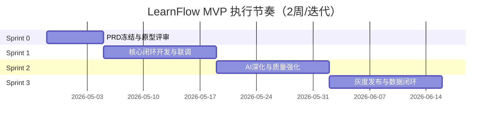

# LearnFlow Sprint Backlog v1（可直接执行）

版本：v1.0  
周期：建议 3 个 Sprint（每个 2 周）  
范围：不含支付集成

## 1. 总体节奏

## 2. Sprint 0（产品冻结与技术准备）

## 目标

- 冻结 MVP 范围
- 原型评审通过
- 技术方案评审通过

## Backlog

| ID | 任务 | Owner | 预估 |
| --- | --- | --- | --- |
| S0-01 | PRD v1 评审并冻结（含 out-of-scope） | PM | 1d |
| S0-02 | 原型评审（关键流程 8-12 页面） | PM/Design/FE | 1d |
| S0-03 | 后端模块拆分设计（learning/ai/analytics） | BE | 1d |
| S0-04 | 前端 feature 目录拆分设计 | FE | 0.5d |
| S0-05 | 埋点方案定义（激活/留存/执行率） | PM/BE | 0.5d |
| S0-06 | 测试计划与用例基线（10 条） | QA | 1d |
| S0-07 | 发布门禁与回滚流程确认 | BE/QA | 0.5d |

## 验收标准

- PRD、原型、架构三方签字
- Sprint 1 的 Story 全部达到 DoR

---

## 3. Sprint 1（MVP 核心闭环）

## 目标

上线可用的核心学习闭环：登录 -> 目标 -> 计划 -> 任务 -> 打卡 -> 复盘

## Backlog（后端）

| ID | 任务 | Owner | 预估 |
| --- | --- | --- | --- |
| S1-BE-01 | AI Orchestrator 基础版（统一入口） | BE | 2d |
| S1-BE-02 | 计划生成结构化 schema 校验 | BE | 1.5d |
| S1-BE-03 | AI 失败回退策略标准化 | BE | 1d |
| S1-BE-04 | 任务完成触发进度重算优化 | BE | 1d |
| S1-BE-05 | 复盘接口增强（AI 总结字段） | BE | 1.5d |
| S1-BE-06 | 核心接口埋点（成功率/耗时） | BE | 1d |

## Backlog（前端）

| ID | 任务 | Owner | 预估 |
| --- | --- | --- | --- |
| S1-FE-01 | Planner 页面接入结构化计划渲染 | FE | 2d |
| S1-FE-02 | 任务页完成态与进度联动 | FE | 1.5d |
| S1-FE-03 | 打卡页体验优化（错误态/空态） | FE | 1d |
| S1-FE-04 | 复盘页展示 AI 建议模块 | FE | 1.5d |
| S1-FE-05 | 仪表盘关键指标卡（完成率等） | FE | 1.5d |

## Backlog（测试）

| ID | 任务 | Owner | 预估 |
| --- | --- | --- | --- |
| S1-QA-01 | API 集成测试（核心 6 组） | QA | 2d |
| S1-QA-02 | E2E 主路径（5 条） | QA | 2d |
| S1-QA-03 | 异常路径（token 过期/AI 失败） | QA | 1d |

## 验收标准

- 核心流程 E2E 全通过
- AI 失败回退可用率 100%
- P0 缺陷 0 个

---

## 4. Sprint 2（AI 深化 + 质量强化）

## 目标

把 AI 从“生成器”升级为“学习助手”

## Backlog

| ID | 任务 | Owner | 预估 |
| --- | --- | --- | --- |
| S2-01 | AI 对话助手（会话上下文） | BE/FE | 3d |
| S2-02 | 学习行为分析接口（周报数据） | BE | 2d |
| S2-03 | 智能复习建议（规则+模型） | BE | 2d |
| S2-04 | 周报页面（趋势+建议） | FE | 2d |
| S2-05 | Prompt 回归测试脚本 | QA/BE | 1.5d |
| S2-06 | 关键指标告警（失败率/耗时） | BE | 1d |

## 验收标准

- AI 结构化可解析率 >= 98%
- 周报流程可跑通
- 任务完成率较 Sprint 1 提升（对照观察）

---

## 5. Sprint 3（灰度与运营闭环）

## 目标

可灰度发布并形成数据反馈闭环

## Backlog

| ID | 任务 | Owner | 预估 |
| --- | --- | --- | --- |
| S3-01 | 灰度开关接入（按用户/比例） | BE | 1.5d |
| S3-02 | 运营看板（激活/留存/执行率） | FE/BE | 2d |
| S3-03 | 新手引导优化（首日完成率） | FE | 1.5d |
| S3-04 | 线上巡检脚本与回滚演练 | BE/QA | 1.5d |
| S3-05 | 版本复盘与下一期规划 | PM/全员 | 1d |

## 验收标准

- 灰度版本稳定运行 7 天
- 主链路成功率 >= 99%
- 得到下一阶段优先级清单（RICE）

---

## 6. 日常执行模板（建议贴看板卡片）

- 背景/目标：
- 验收标准：
- 技术方案：
- 风险点：
- 测试点：
- 上线影响面：

## 7. 每日站会模板

- 昨天完成：
- 今天计划：
- 当前阻塞：
- 需协同事项：
