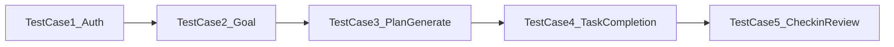

# MVP 主链路测试基线（Phase1）

用于 Sprint1 验收，覆盖“注册->目标->计划->任务->打卡->复盘”。

## 用例列表（最小集 5 条）

1. 注册与登录成功
2. 新建目标并可查询详情
3. 生成学习计划并落库任务
4. 完成任务后目标进度更新
5. 打卡 + 新建复盘成功

## 建议执行顺序

## 详细口径

## TC-01 注册与登录

- 请求：`POST /api/auth/register` + `POST /api/auth/login`
- 期望：
  - 返回 token
  - 可访问受保护接口 `GET /api/auth/me`

## TC-02 目标创建与查询

- 请求：`POST /api/goals`，随后 `GET /api/goals/:id`
- 期望：
  - 创建成功，状态为 `ACTIVE`
  - 详情接口可返回该目标

## TC-03 AI 计划生成

- 请求：`POST /api/plans/generate`
- 期望：
  - 返回计划对象
  - 数据库中产生 `plan` 和关联 `task`

## TC-04 任务完成与进度联动

- 请求：`PATCH /api/tasks/:id`（或兼容 `PUT /api/tasks/:id/complete`）
- 期望：
  - 任务状态变更成功
  - 目标进度更新（>0）

## TC-05 打卡与复盘

- 请求：`POST /api/checkins` + `POST /api/reviews`
- 期望：
  - 打卡记录创建成功
  - 复盘记录创建成功

## 验收标准

- 5 条全部通过
- 无 P0 缺陷
- 失败用例有可复现日志与修复责任人
