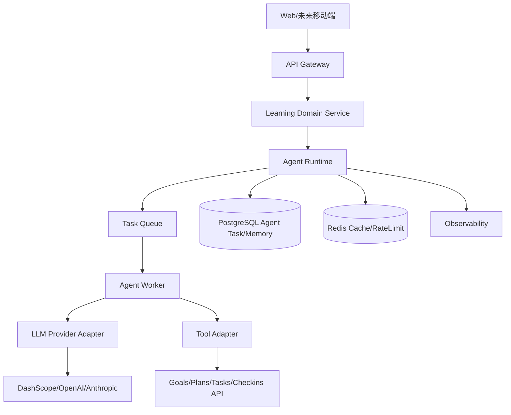

# LearnFlow 下一阶段方案（借鉴 Harness Agent 设计）

## 1. 调研结论（Harness 可借鉴点）

本次已拉取并调研 `https://github.com/harness/harness`，重点关注了 `AI Task + Orchestrator` 相关实现。  
可直接借鉴的核心不是“模型能力本身”，而是它的**工程化 Agent 运行体系**：

1. **Agent 类型枚举化与白名单校验**
  - 参考 `types/enum/ai_agent.go`
  - 好处：避免前后端字符串漂移，新增 Agent 类型可控。
2. **Agent 鉴权类型独立建模**
  - 参考 `types/enum/ai_agent_auth.go`
  - 好处：后续可接多供应商（DashScope/OpenAI/Anthropic）而不污染业务模型。
3. **任务状态机标准化**
  - 参考 `types/enum/ai_task_state.go`（`uninitialized/running/completed/error`）
  - 好处：任务可恢复、可重试、可观察。
4. **事件驱动执行**
  - 参考 `app/services/aitaskevent/service.go` + `handler.go`
  - 好处：将“提交任务”和“执行任务”解耦，系统更抗抖动。
5. **Orchestrator 插件化安装/配置 Agent**
  - 参考 `app/gitspace/orchestrator/utils/ai_agent.go`
  - 用 `installationMap/configurationMap` 管理不同 Agent 的生命周期动作。
6. **密钥解密与运行时注入**
  - 参考 `orchestrator_resume.go` 的 `decryptAIAuth`
  - 好处：密钥不落业务日志，运行时按需注入。
7. **AI 任务成本指标模型**
  - 参考 `types/ai_task.go` 中 `AIUsageMetric`
  - 好处：后续计费、限额、ROI 分析有数据基础。

---

## 2. 对 LearnFlow 的架构建议（面向未来 12-18 个月）

### 2.1 当前架构问题

- 目前 AI 能力偏“接口直连”，缺少统一 Agent Runtime。
- `plans/reviews/adaptive` 各自实现重试与降级，重复逻辑开始增多。
- 观测有基础，但缺少面向 Agent 的任务级指标模型。

### 2.2 目标架构（建议）

### 2.3 技术架构变更建议

- **短期（不拆栈）**：继续 Node.js + TypeScript，新增 `Agent Runtime` 模块。
- **中期（可选）**：引入独立 `agent-worker` 进程（同仓库）处理长耗时任务。
- **长期（按规模）**：演进为微服务：
  - `learnflow-api`（业务 API）
  - `learnflow-agent-runtime`（任务编排）
  - `learnflow-agent-worker`（执行器）
  - `learnflow-observer`（指标与告警）

> 结论：先“模块化单体 + 异步任务化”，再按流量拆服务，避免过早微服务。

---

## 3. 下一阶段开发任务（详细执行版）

## Phase A（2 周）：Agent Runtime 最小可用版

### A1. 数据模型

- 新增表：`agent_tasks`
  - 字段：`id/taskType/agentType/state/input/output/errorMessage/requestId/costTokens/costUSD/startedAt/endedAt/userId`
- 新增表：`agent_memories`
  - 字段：`id/userId/key/value/updatedAt`

### A2. 枚举与状态机

- 枚举：
  - `AgentType`: `planner/reviewer/coach/adapter`
  - `AgentTaskState`: `uninitialized/running/completed/error/cancelled`
  - `ProviderType`: `dashscope/openai/anthropic`
- 规则：
  - `uninitialized -> running -> completed|error|cancelled`
  - 非法状态流转直接拒绝并记录审计日志。

### A3. 运行时与队列

- 新增目录建议：
  - `server/src/agent/runtime/`*
  - `server/src/agent/workers/`*
  - `server/src/agent/providers/`*
- 引入队列（建议 `bullmq` + Redis）
  - API 只负责创建任务
  - Worker 异步执行并回填结果

### A4. 验收标准

- API 返回 `taskId`，前端可轮询任务状态
- 失败时输出明确 `errorMessage + requestId`
- 全链路日志可定位到单条任务

## Phase B（2 周）：四类 Agent 落地

### B1. Planner Agent

- 负责学习计划生成（替换当前直连 AI 逻辑）

### B2. Reviewer Agent

- 负责周期复盘摘要与建议

### B3. Coach Agent

- 负责每日任务提醒与执行建议

### B4. Adapter Agent

- 根据完成率/专注度动态调整下周节奏

### B5. 验收标准

- 四类 Agent 共享统一 Runtime 与 Provider Adapter
- 至少 80% AI 路径经过 `agent_tasks` 记录

## Phase C（1-2 周）：可观测性与灰度治理

### C1. 指标体系

- 任务成功率
- fallback 率
- P95 时延
- 每任务 token/cost
- 各 agentType 错误分布

### C2. 灰度

- 按用户百分比启用 Agent Runtime
- 支持一键回退到旧直连路径

### C3. 验收标准

- 监控面板可看到最近 24h Agent 健康度
- 回退演练可在 10 分钟内完成

## Phase D（2 周）：Agent 模式产品化

### D1. 前端能力

- 新增 Agent 任务中心（状态、日志、重试）
- Dashboard 增加“AI 教练建议”卡片

### D2. 运营能力

- 增加“建议采纳率”埋点
- 建立 A/B 实验：不同提示词策略

### D3. 验收标准

- 用户可感知 Agent 连续服务能力（而非单点功能）

---

## 4. 关键实现步骤（按顺序）

1. 建表与 Prisma schema 更新
2. 定义 enum + DTO + OpenAPI 合同
3. 实现 `AgentTaskService`（创建/查询/状态更新）
4. 接入队列与 Worker
5. 抽离 Provider Adapter（DashScope 优先）
6. 将 `plans/reviews/adaptive` 迁移到 Runtime
7. 上线灰度开关与回退开关
8. 补齐监控与告警

---

## 5. 10 条测试用例（输入与预期）

1. 创建 planner 任务（正常输入） -> 状态最终 `completed`
2. 创建 planner 任务（缺失必填） -> 400 校验失败，不入队
3. provider 返回 400 -> 任务 `error`，有 `requestId`
4. provider 超时 -> 任务 `error` 或 `fallback completed`
5. 同用户并发 5 个任务 -> 不丢任务，状态准确
6. worker 重启后 -> `running` 任务可恢复或重试
7. 灰度关闭后 -> 走旧逻辑，不创建新任务
8. fallback 命中 -> 前端展示明确降级提示
9. task 重试 -> 新增重试记录，不覆盖原任务审计信息
10. cost 指标采集 -> 面板可查看 token 与费用统计

---

## 6. 风险与对策

- **风险**：队列引入后复杂度提升  
**对策**：先只迁移 planner/reviewer 两条链路，逐步替换。
- **风险**：多 Provider 行为不一致  
**对策**：统一 `ProviderAdapter` 输出结构 + schema guard。
- **风险**：Agent 成本不可控  
**对策**：按用户层级限额 + 任务级 cost 指标告警。

---

## 7. 与当前路线一致性结论

本方案与既有“深度融合 AI”路线一致，并且把原来“功能级 AI”升级到“系统级 Agent 运行体系”。  
换句话说：方向不变，工程层级上升，可支撑未来多 Agent、多模型、多端扩展。