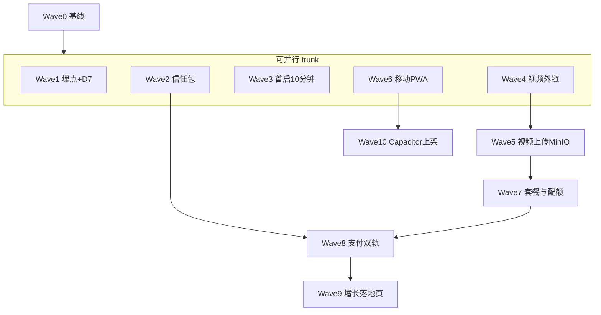

# LearnFlow to C SaaS — Agent 自动开发执行计划

版本：v1.1  
状态：待评审  
**上游产品文档**：`15-toc-saas-rice-backlog.md`（v1.3+，与本文 §8.1 结论对齐）  
**用途**：供 **Agent / 自动化研发** 按波次 **逐项实现 + 逐项验证**；每波结束须满足「可演示 + 可回归」再进入下一波。

---

## 1. 执行原则

1. **严格对齐 `15` 文档**：必达项（§1.1）不因工期从验收中删减；RICE 仅用于同一波内任务排序。  
2. **每波一个可合并主线**：避免巨型 PR；每波产出独立可测。  
3. **验证优先**：每波列出 **自动化**（单测/E2E）与 **手工** 清单；无验证则视为未完成。  
4. **不可行须显式停工并升级**：见 §7；Agent 不得伪造支付回调、法务文书终稿。  
5. **技术选型锚定现栈**：`React 19 + Vite + TypeScript + Tailwind`（client），`Express + Prisma + PostgreSQL + Redis`（server）；不引入与现栈冲突的第二套前端框架。

---

## 2. 移动端技术选型（基于现栈）

| 方案 | 内容 | 优点 | 缺点 | 建议阶段 |
| --- | --- | --- | --- | --- |
| **A. 响应式 Web + PWA** | Tailwind 断点加固、`manifest` + `vite-plugin-pwa`（或等价）、安全区 `env(safe-area-inset-*)`、触控目标 ≥44px | **零第二代码库**；与 Vite 一体；迭代最快 | iOS 上 Web Push 能力弱；后台播放/画中画受浏览器策略限制；**应用商店无独立包**（除非配合 B） | **Phase 1 默认采用**（对齐 `15` §4 P0） |
| **B. Capacitor 壳** | 将 `npm run build` 产物包进原生壳，上架 TestFlight / Google Play Internal Testing | **复用全部 React 页面**；可补推送、深度链接、部分原生 API | 需 Apple/Google 开发者账号与审核周期；CI 变复杂；调试要真机 | **Phase 2 必达 M-SaaS-2**（与 `15` v1.3 必达项一致，**非可选**） |
| **C. 独立 React Native / Expo** | 新客户端工程 | 体验上限高 | **与现栈重复建设**、双份业务逻辑、成本高；与 `15` §7「不从零纯原生重写」冲突 | **本路线不推荐** |
| **D. Tauri Mobile / 其他** | 非 Web 技术栈主导 | — | 生态与团队习惯偏离大；风险高 | **不推荐** |

**结论（写死为默认开发方案）**

- **Phase 1**：**A** 单轨交付至「手机浏览器 + 安装到主屏幕（PWA）可完成核心闭环」。  
- **Phase 2**：在 A 稳定后，**叠加 B**，**M-SaaS-2 内** 完成 **Capacitor + TestFlight + Google Play Internal** 内测分发；不替换 A。

---

## 3. 视频双形态技术要点（外链 + 上传，已冻结）

| 形态 | 后端要点 | 前端要点 | 风险 |
| --- | --- | --- | --- |
| **外链** | URL 校验、**固定域名白名单**（首版：`bilibili.com`、`youtube.com`、`vimeo.com`，评审后可增减）；服务端中间件（如 `server/src/middleware/embedWhitelist.ts`）拒绝其他域；`iframe` 使用 `sandbox="allow-scripts allow-same-origin"`；CSP 策略与文档 | 嵌入组件、错误态、**iOS Safari** 对 iframe 限制时的 **跳转外站** fallback | **版权与平台 ToS** 由用户承担，须在 UI 与条款中写明；**Admin 可配置白名单** 标 P2，Wave 4 不做 |
| **上传** | **MinIO 自建**（`docker-compose` 单节点，控制台 9001、API 9000，凭据 `.env`）；使用 **`@aws-sdk/client-s3` + `@aws-sdk/s3-request-presigner`** 做预签名 PUT/GET（S3 兼容 API，**不引入 minio-js** 以免双 SDK）；**禁止**生产默认落本地盘 | 分片上传（大文件时）、进度条、MIME/格式提示 | 无 CDN 时带宽瓶颈；**单节点 HA 不在本期**（见 §7） |
| **配额** | 与套餐绑定：**Free** 总存储 **2GB**、单文件 **500MB**；**Pro** 总存储 **20GB**、单文件 **2GB**（数值可经 env 微调，与 `User.plan` 或等价字段联动）；超限返回 **402** | 超限文案与升级引导 | 需与 Wave 7 套餐表一致 |

**Agent 交付顺序**

1. **先外链**（Wave 4）：模型与 API 简单，易 E2E。  
2. **后上传**（Wave 5）：依赖 MinIO 与配额中间件。  
3. **最终验收**：同一计划下可混用两种资源，任务完成与进度规则一致。

---

## 4. Agent 波次计划（逐项完成与验证）

> 每波 **完成定义**：PR 合并 + 验证清单全勾 + `15` 对应条目可演示。

### Wave 0 — 工程基线（0.5–1 人周）

| 项 | Agent 动作 | 验证 |
| --- | --- | --- |
| 分支与规范 | 从 `main` 拉 `feat/saas-wave0`；约定 commit 前缀与 PR 模板 | CI/本地 `client` build、`server` 可启动 |
| 文档链接 | 在 `AGENTS.md` 或 README 增加指向 `15`、`16` | 链接可打开 |

### Wave 1 — 数据与增长基建：埋点 + D7 可证（对齐 `15` P0 首行）

| 项 | Agent 动作 | 验证 |
| --- | --- | --- |
| 事件 SDK | 前端封装 `track(event, props)`；后端可选接收批或写 Redis 计数 | 单元测试 mock 发送 |
| 关键事件 | 注册成功、首目标创建、首计划生成、首任务完成、日活心跳、**Onboarding 步骤**（为 Wave3 预留） | **Playwright** 或现 E2E 扩展 1 条链路断言事件发出 |
| D7 报表 | **最小可行**：每日 job 或按需 SQL「cohort 注册日 → 第 7 日回访」；**仅内部 Ops 页或只读 API**（不向终端用户开放，与 §8.1 Q6 一致） | 种子用户 + 文档说明时间 mock 限制 |

**不可行（须人工/外部）**：与真实 **广告归因（SKAN/GA4）** 全量打通；本波只做 **自有事件 + 内部报表**。

### Wave 2 — 信任包（对齐 `15` P0）

| 项 | Agent 动作 | 验证 |
| --- | --- | --- |
| 静态页 | 隐私政策、服务条款、AI 说明、Cookie 提示（若埋点用 cookie） | 链接在 Layout 页脚可见 |
| 账号 | 删除账号 API + 软删/级联策略；导出 JSON（核心实体） | E2E：注册 → 导出 → 删除 → 无法再登录 |
| 文案占位 | 使用「模板+待法务替换」占位符 | PR 中 checklist 标「需法务」 |

### Wave 3 — 首启 10 分钟闭环（对齐 `15` P0）

| 项 | Agent 动作 | 验证 |
| --- | --- | --- |
| 引导流 | 分步组件：目标 → 触发 AI 计划 → 展示当日任务；可跳过 | E2E：计时或步骤计数；埋点每步 `onboarding_step_*` |
| 状态持久化 | `localStorage` + 服务端用户标记防重复骚扰 | 刷新后继续 |

### Wave 4 — 视频：外链嵌入（对齐 `15` §1.2）

| 项 | Agent 动作 | 验证 |
| --- | --- | --- |
| 数据模型 | `VideoResource`：`type=EMBED`、url、元数据、关联 `planId/taskId/goalId`（按领域模型裁剪） | `prisma db push` 成功 |
| 白名单 | **仅允许** `bilibili.com`、`youtube.com`、`vimeo.com`（子域需规范化后比对，如 `www.`）；**Admin 可配置白名单** 列为 P2，本波不做 | 单测：非白名单域 → 拒绝 |
| API | CRUD + 白名单校验 | 同上 |
| UI | 嵌入页 + 移动端 iframe 降级 / 跳转外站 | 手工：iOS Safari 抽样 |

### Wave 5 — 视频：MinIO 上传 + 分套餐配额（对齐 `15` §1.2 与 §8.1）

| 项 | Agent 动作 | 验证 |
| --- | --- | --- |
| 基础设施 | `docker-compose.yml` 增加 **minio** service（API 9000、控制台 9001）；`server/.env.example` 增加 `MINIO_*` | 本地 `docker compose up minio` 可访问控制台 |
| 存储服务 | `server/src/services/storageService.ts`：预签名 PUT/GET；**仅用** `@aws-sdk/client-s3` + `@aws-sdk/s3-request-presigner` | 单测 mock S3 client |
| API | `POST /api/videos/upload-url`、`POST /api/videos` 等（路径以实际路由为准）；`VideoResource.type=UPLOAD`、`sizeBytes` | E2E：小文件上传 + 绑定任务 |
| 配额 | `quotaGuard`：**Free** 累计 ≤2GB、单文件 ≤500MB；**Pro** 累计 ≤20GB、单文件 ≤2GB；与 `User` 套餐字段联动；超限 **402** | 单测边界 |
| UI | 上传组件 + 进度条 | 与 Wave 4 混用验收 |

**不可行（本波不承诺）**：**自动转码多码率**、**版权检测**、**全网爬视频**；转码须单独 Wave 与 FFmpeg 队列预算。

### Wave 6 — 移动端 Phase 1（对齐 `15` P0）

| 项 | Agent 动作 | 验证 |
| --- | --- | --- |
| PWA | `manifest`、图标、`vite-plugin-pwa` 或等价；HTTPS 说明 | Lighthouse PWA 项记录 |
| 响应式 | 修 Dashboard/任务/视频页断点；底部导航若需要 | 真机或设备模拟完成一次打卡 |
| 安全区 | `env(safe-area-inset-*)` 全局或 utility | iPhone 刘海屏截图 |

### Wave 7 — AI 与增值配额闭环（对齐 `15` P0）

| 项 | Agent 动作 | 验证 |
| --- | --- | --- |
| 计数 | Redis/DB 计 AI 调用次数、**视频存储用量**（与 Wave 5 一致） | 超限拦截 + Ops 或日志可查询 |
| 产品规则 | Free/Pro 配置（**含视频存储与单文件上限**，与 §8.1 Q4 一致） | 单测覆盖边界 |

### Wave 8 — 轻量商业化：支付订阅 MVP — **Stripe + 微信 + 支付宝直连**（对齐 `15` P0 与 §8.1 Q1）

| 项 | Agent 动作 | 验证 |
| --- | --- | --- |
| 抽象层 | `server/src/services/payment/PaymentProvider.ts`（`createCheckout`、`verifyWebhook`、`syncSubscription` 等接口） | 单测 mock 多实现 |
| Stripe | `StripeProvider`：订阅 + Webhook 签名校验 | 沙箱完整订阅流 |
| 国内直连 | `WechatPayProvider` + `AlipayProvider`（**Native/当面付 + JSAPI** 等按产品裁剪；签名使用 **`wechatpay-node-v3`**、**`alipay-sdk`**） | 沙箱/沙箱模拟联调 |
| 路由 | `POST /api/billing/checkout` 带 `provider` 或 `region` 参数分流；Webhook **各自独立路径** | 伪造请求单测须失败 |
| 宽限 | 文档 + 定时任务标记欠费 | 手工演示 |

**Agent 不可单独完成**：**微信/支付宝商户号、营业执照、对公账户、ICP 备案**；Agent 仅做 **沙箱联调 + 特性开关**；生产开关须人工签字。

### Wave 9 — 增长与卖点落地（对齐 `15` P1）

| 项 | Agent 动作 | 验证 |
| --- | --- | --- |
| 落地页 | 营销首页 + FAQ + 定价对比（与套餐、双支付说明一致） | 文案与 `15` §2 无矛盾 |
| 邮件/Web Push | 选用一种：如 Resend/SendGrid + 模板；Push 优先 PWA/Android | 沙箱发信成功记录 |

### Wave 10 — 移动端 Phase 2：Capacitor + TestFlight + Google Play Internal（**必达 M-SaaS-2**，对齐 §8.1 Q5）

| 项 | Agent 动作 | 验证 |
| --- | --- | --- |
| 工程 | `@capacitor/core`、`@capacitor/ios`、`@capacitor/android`；Web 资源来自 `client/dist/` | `npx cap sync` 无报错 |
| 脚本 | `client/scripts/cap-release.*`（或文档化命令）：构建、同步、打开 Xcode/Android Studio | README 一段可复制命令 |
| 上架 | **TestFlight** + **Google Play Internal Testing** 提交（二进制与元数据占位） | **能提交内测**（不承诺商店审核通过日，见 §7） |
| 推送/深链 | **占位接入**，完整推送可后置 | 代码中有 TODO 与开关 |

---

## 5. 与 `15` 必达项的映射表

| `15` §1.1 必达项 | 主要覆盖 Wave |
| --- | --- |
| 首启 10 分钟 | W3 |
| 埋点 + D7（内部 Ops） | W1 |
| 信任包 | W2 |
| 增长 / Onboarding | W3 + W9 |
| 商业化 + 配额 | W7 + W8 |
| 移动端 Phase 1 + **Phase 2（Capacitor 上架）** | W6 + **W10** |
| 视频（外链白名单 + MinIO 上传 + 分套餐配额） | W4 + W5 |

---

## 6. 验证总表（每波通用）

| 类型 | 最低要求 |
| --- | --- |
| 自动化 | 本波改动模块：新增/更新 **Vitest 或 Jest**；触达 UI 的加 **Playwright** 一条正向路径 |
| 回归 | `15` 中本波对应能力手工 smoke |
| 安全 | 无密钥进仓库；上传/外链经服务端校验 |
| 文档 | 更新 `server/env.example` / `client/env.example`；本波在 `16` 附录勾选完成 |

---

## 7. 明确不可行、须降级或不可控的内容

| 内容 | 原因 | 建议 |
| --- | --- | --- |
| **无商户号的真实收款** | 依赖外部主体与合规 | 仅用沙箱 + 特性开关 |
| **国内直连支付商户合规** | 微信/支付宝商户号、营业执照、对公、ICP **须人工** | 并行启动资质申请，不阻塞开发沙箱 |
| **Capacitor / TestFlight / Google Play 审核通过日期** | 平台审核周期 **不在 Agent 可控范围**（常见 1–2 周账号 + 1–2 日内测审核） | **立即** 并行申请开发者账号；里程碑保留缓冲周 |
| **全自动版权合规** | 需内容识别与法务流程 | 用户协议 + 举报入口 + 人工下架（后续） |
| **免费无限视频转码** | CPU/GPU 与存储成本 | 首版原片播放；转码单独立项 |
| **MinIO 生产级多副本 HA** | 运维与成本 | 本期单节点 + `mc mirror` 等备份脚本占位（见 `15` DoR） |
| **iOS 后台持续计时与 Web Push 与 Android 完全对齐** | 系统限制 | 文档说明 + 邮件/日历提醒兜底 |
| **Agent 自动生成具法律效力隐私政策** | 非工程能力 | 律师模板 + 占位符 |

---

## 8. 须你（产品/负责人）确认的信息

**以下六项已由负责人确认，结论见 §8.1。** 若变更支付渠道或存储厂商，须更新 §8.1 并重新评审 Wave 5/8。

---

## 8.1 确认结论回填区（已填写）

| 问题编号 | 结论 | 日期 | 签字人 |
| --- | --- | --- | --- |
| Q1 | **Stripe + 微信支付 + 支付宝（直连）** 双轨均需 | 2026-05-02 | 待评审会签字 |
| Q2 | **MinIO 自建**（`docker-compose` 单 bucket；生产备份策略另议，见 `15` DoR） | 2026-05-02 | 待评审会签字 |
| Q3 | **固定域名白名单**：`bilibili.com`、`youtube.com`、`vimeo.com`（评审后可增减；**不支持任意 https**） | 2026-05-02 | 待评审会签字 |
| Q4 | **分套餐**：Free 总 **2GB** / 单文件 **500MB**；Pro 总 **20GB** / 单文件 **2GB** | 2026-05-02 | 待评审会签字 |
| Q5 | **Capacitor + TestFlight + Google Play Internal 上架内测**，**必达 M-SaaS-2** | 2026-05-02 | 待评审会签字 |
| Q6 | **D7 报表接受先做内部 Ops 看板**（不向终端用户公开） | 2026-05-02 | 待评审会签字 |

---

## 9. 修订记录

| 日期 | 版本 | 说明 |
| --- | --- | --- |
| 2026-05-02 | v1.0 | 首版：基于 `15` 的 Agent 波次计划、移动选型、视频双轨、验证与不可行项、待确认问题 |
| 2026-05-02 | v1.1 | 回填 §8.1（双支付、MinIO、白名单、分档配额、Capacitor 必达 M-SaaS-2、D7 Ops）；Wave 4/5/8/10 细化；§3 MinIO+AWS SDK+配额数值；§7 增补审核与商户风险；Mermaid 增加 W10 |
